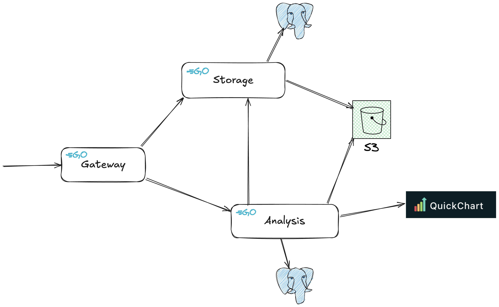

# Designing Software, control work 2

## Architecture



## How to use

First off, you should run backend. For this you should follow "Prerequests" and "Run" sections below.

Then load Postman collection from [**./postman/control-work-2.postman_collection.json**](postman/control-work-2.postman_collection.json) and use it.

## Prerequests

Backend is cloud native and ready to be ran in Kubernetes cluster, so here we go.

Install `minikube`: [tap](https://minikube.sigs.k8s.io/docs/start/?arch=%2Fmacos%2Farm64%2Fstable%2Fbinary+download)

Install `helm`: [tap](https://helm.sh/docs/intro/install/)

Enable Ingress controller for minikube cluster

```bash
minikube addons enable ingress
```

Start local Kubernetes cluster

```bash
minikube start
```

Install CloudNativePG operator into local cluster

```bash
kubectl apply --server-side -f \
  https://raw.githubusercontent.com/cloudnative-pg/cloudnative-pg/release-1.25/releases/cnpg-1.25.1.yaml
```

## Run

NOTE: You can use `just run` instead of all the steps below.

Build docker images

```bash
./build-docker.sh
```

Install Helm shart

```bash
helm install cw2 ./helm --values helm/values-local.yaml
```

Make minikube tunnel gateway traffic

```bash
minikube tunnel
```

Check if it is working

```bash
curl http://localhost/storage/file/1
```
